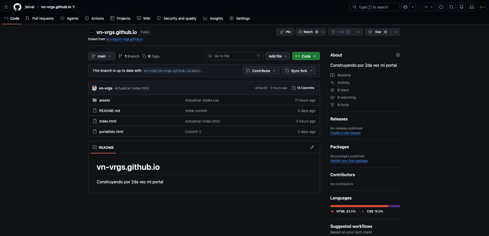
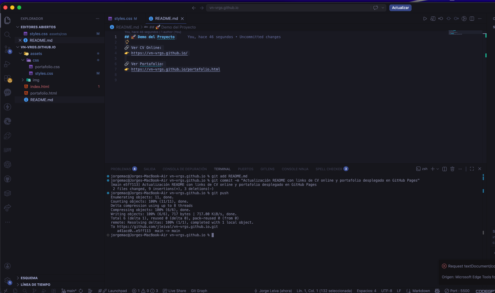
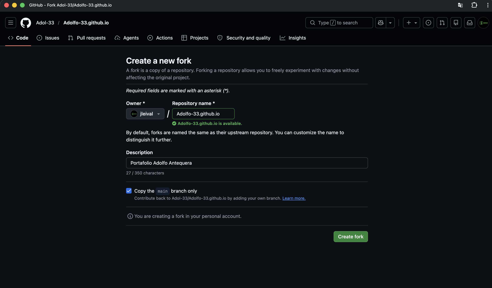
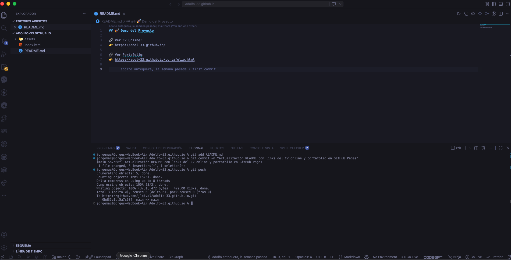

# 📌 Descripción del Proyecto

Este proyecto consiste en el desarrollo de un Curriculum Vitae Web profesional junto a una página de portafolio, construido utilizando tecnologías frontend modernas.

## 🚀 Demo del Proyecto

🔗 Ver CV Online:
👉 https://jleival.github.io/

🔗 Ver Portafolio:
👉 https://jleival.github.io/portafolio.html

# 🤝 Colaboración en Proyectos

Durante el desarrollo de este desafío, se realizaron contribuciones en repositorios de compañeros como parte del trabajo colaborativo en GitHub.

---

## 👤 Colaborador

- Iván

---

## 📸 Forks realizados

Fork realizado al repositorio del compañero Iván:



---

## 📸 Commits realizados

Commit realizado en el repositorio forkeado de Iván:



---
# 👤 Colaborador

- Adolfo

---

## 📸 Forks realizados

Fork realizado al repositorio del compañero Adolfo:



---

## 📸 Commits realizados

Commit realizado en el repositorio forkeado de Adolfo:



---
## 🛠️ Tecnologías utilizadas
- HTML5  
- CSS3  
- Bootstrap 5.3  
- Bootstrap Icons  
- Google Fonts  
- Normalize.css

## 📁 Estructura del proyecto
```
📁 proyecto/
├── index.html
├── portafolio.html
├── assets/
│ ├── css/
│ └── img/
```
## ✨ Características

- CV profesional con navegación  
- Portafolio con proyectos reales  
- Diseño moderno y limpio  
- Uso de Bootstrap y componentes UI  
- Responsive design  

## 📋 Requerimientos Cumplidos

- ✔ CV en HTML y CSS  
- ✔ Navbar + secciones + footer  
- ✔ Página de portafolio  
- ✔ Imágenes de proyectos  
- ✔ Deploy en GitHub Pages  
- ✔ Fork de compañeros  
- ✔ Commits realizados  

## 📞 Contacto

- GitHub: [jleival](https://github.com/jleival)  
- WhatsApp: +56 9 8475 9035  

## 👨‍💻 Autor

**Jorge Alfredo Leiva López**  
Ingeniero Informático | Soporte TI | Gestión Operativa
